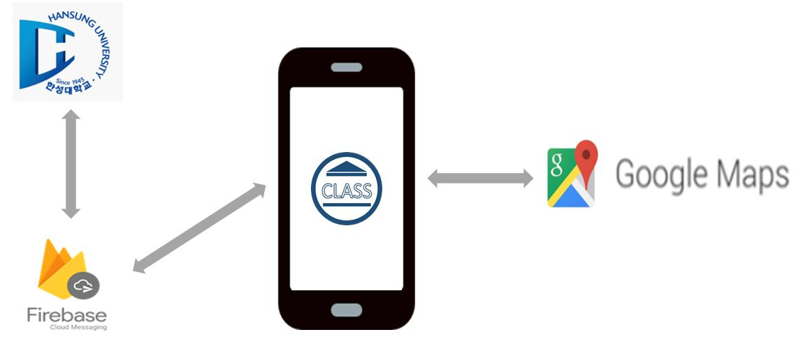
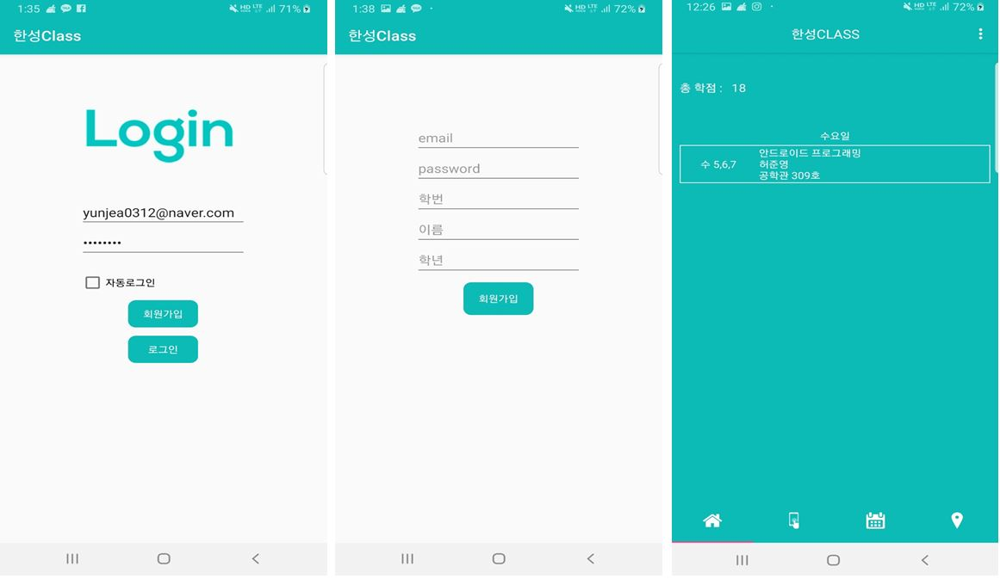
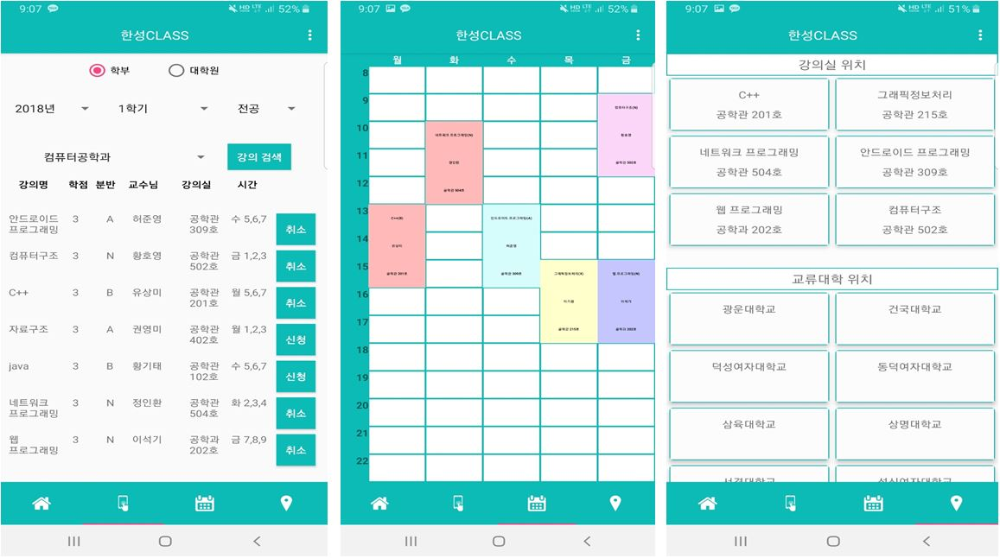

# HansungClass App (Android)

## Intoduction

학교를 다니면서 수강신청을 할 때 우리는 대부분 컴퓨터나 노트북을 이용하여 신청을 하곤 한다. 하지만 수강신청은 시간이 정해져 있기 때문에 그 시간이 될 때까진 수강신청을 해볼 수가 없다. 특히 신입생들 같은 경우는 처음 대학에 들어오면서 수강신청 해 본적이 없기 때문에 막상 당일이 될 때 실수를 많이 하게 되어 듣고 싶은 수업을 듣지 못하게 되고, 자기가 원하는 대학생활을 하지 못하게 된다.

이러한 신입생들을 위하여 핸드폰을 통하여 수강신청을 하기 전에 모의 수강신청app을 통해 미리 연습을 할 수 있는 기회를 주고, 신청한 강의실의 위치 및 정보를 미리 알려 줌으로써 수강신청 당일 날 좀더 편리 하게 할 수 있게 해주는 app을 개발하게 되었다.

## Service

{:width="30%" }

## Application

### 1. Initial Screen + Home Screen

### 2. Main Screen

